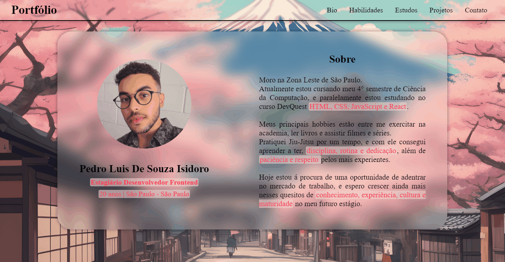
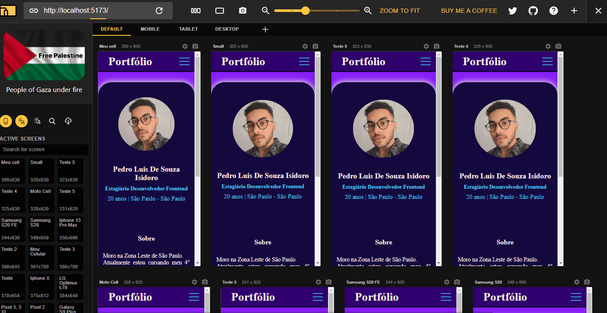

# Portifolio

## Objetivo
- Reconstruir meu antigo portifólio, trazendo meus novos conhecimentos adquiridos com o tempo de estudo, esforço e prática.
- Ter páginas para:
    - Sobre.
    - Tecnologias que aprendi.
    - Estudos.
    - Projetos já feitos.
    - Redes de contato.

## Tecnologias Utilizadas
### Linguagens
- HTML
- CSS
- JavaScript
### Bibliotecas
- React + Vite
- React Hook Form
- EmailJS
- React Rounter

## Desafios
- A priori como qualquer projeto, seria o desafio de construir meu primeiro projeto React do zero, de forma que fique um código limpo e compreensível. 
- Conseguir enviar as informações inseridas no formulário por email.
- Sua responsividade nos diversos tipos de tela.
- Criar um código com Map para mostrar os cards de Hard-skills e projects

## Soluções
- Se utilizando do estudo da Biblioteca React Hook Form, consegui usá-la, e a seus diversos métodos e ferramentas, para realizar validações para as entrada de texto e armazenamento do mesmo.
- E juntamente da Biblioteca EmailJS, com esses dados armazenados pelo Hook Form, utilizei suas ferramentas e métodos para enviar as informações inseridas pelo usuário, por email para a agência.
- Criar 4 arquivos .JSON com os detalhes dos cards, puxar eles com UseEfect e UseState.

## Resultado

### Responsivo
